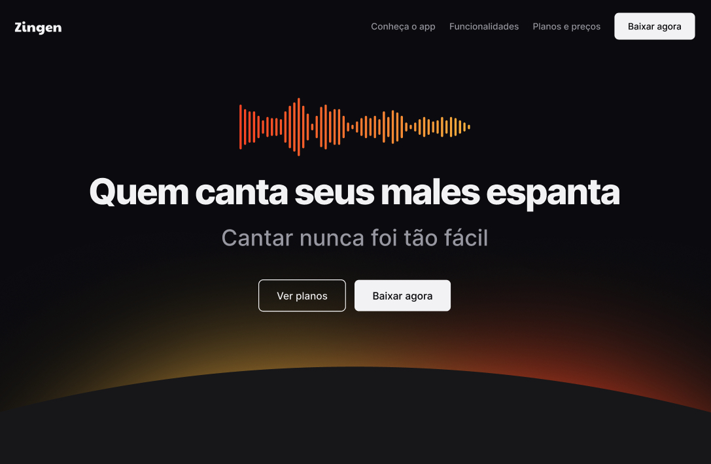

# Zingen
### Projeto de estudo sobre responsividade 

>>>>>>> 7a3f391 (update readme)

### 🚀 Tecnologias

Esse projeto foi desenvolvido com as seguintes tecnologias:

- HTML
- CSS

Bibliotecas
- [Google Fonts](https://fonts.google.com/)

### 💻 Projeto

Landing Page de marketing completa e responsiva de um aplicativo de Karaokê chamado Zingen.

### 🔖 Layout

Você pode visualizar o layout do projeto através [desse link](https://www.figma.com/design/klZV4P2vOrB600wUewwXBw/LP-de-produto--Community-?node-id=2160-1043&t=T3uMX03Iv8VZUKmT-0). 

###  ACESSE A PÁGINA [AQUI](https://amandasgm.github.io/Projeto-de-responsividade/)

Ensinado com ♥ by Rocketseat 
